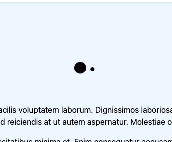
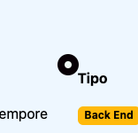
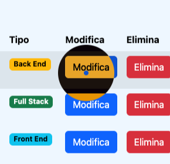

# Boolfolio

Questo é lo sviluppo della precedente repo 'laravel-auth' con l'aggiunta di relazioni tra tabelle, miglioramenti grafici e un cursore personalizzato e animato

## Tabelle

Le tabelle che hanno relazione fra loro sono la tabella types e la tabella projects

## Funzionalità

La funzionalità principale consente agli utenti di:

-   Si puó visualizzare l'elenco dei progetti dopo aver effettuato l'accesso
-   Aggiungere nuovi progetti
-   Modificare progetti esistenti
-   Contrassegnare i progetti con un tipo
-   Eliminare i progetti

C'è anche un cursore personalizzato che cambia passando con il mouse su un'attività:

Il cursore é caratterizzato da una bolla che segue una pallina piccola, e da un'animazione che si muove con il mouse:

 

On hover invece, su link e button la bolla si gonfierá, sempre con un'animazione, c'é tra l'altro un effetto di inversione dei colori per non compromettere la leggibilitá:

